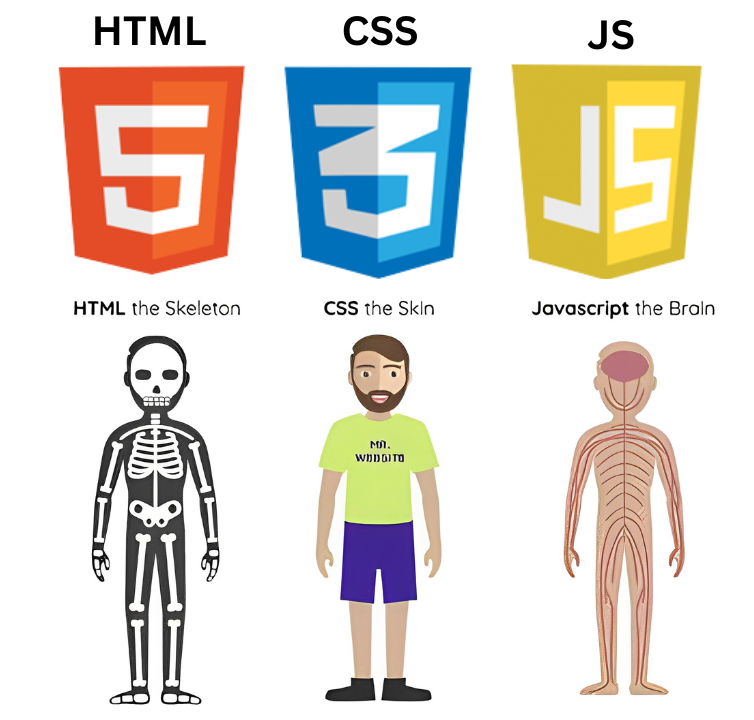

# mlsc-portfolio-project
## Introduction to HTML , CSS and JS

### HTML
It stands for Hyper Text Markup Language
Tags : 
     HTML
     Head
        title
        link
     body
        nav
        section
        div
        p
        heading
        a

### CSS
It stands for Cascading stylesheet 
Properties : 
Tags : 
      padding
      margin 
      text-color
      background-color
      opacity
      flex
      box-sizing
      z-index
      positions - sticky , static , absolute , relative , fixed

### JS(Javascript)
It's the brain of the website , all logical part is created by javascript
Concepts:
    DOM Manipulation
    functions
